  <picture>
    <source media="(prefers-color-scheme: dark)" srcset="assets/dark.svg">
    <source media="(prefers-color-scheme: light)" srcset="assets/light.svg">
    
  </picture>

  
  

---

## 🚀 About Me

🎓 **MCA Student** passionate about **Artificial Intelligence**, **Full Stack Development**, and **System Engineering**. I build optimized deep learning pipelines and high-throughput systems, bridging the gap between advanced models and real-time production environments.

* 🌐 **Full-Stack:** Specializing in Next.js, React, and FastAPI to create reactive, low-latency applications.
* 🧠 **AI/ML:** Implementing lightweight, hardware-aware neural network architectures.
* ⚡ **Systems:** Developing performant proxy mechanisms and model managers.

---

## 🛠️ Technology Stack

| Category | Technologies |
| :--- | :--- |
| **Languages** |    |
| **AI / Machine Learning** |   |
| **Backend & APIs** |   |
| **Frontend & Styling** |   |
| **Tools & Devops** |   |

---

## 🔬 Featured Projects

### 1. 🩺 AI Lung Cancer Detection using CNN
> **An optimized, lightweight Convolutional Neural Network designed for binary classification of CT scans under restricted hardware constraints.**
* Custom image preprocessing pipeline including resizing, pixel intensity normalization, and aggressive data augmentation.
* Balances memory efficiency and processing footprint, achieving **99.67% accuracy** on balanced validation sets.
* *Tech Stack:* `Python`, `TensorFlow`, `Keras`, `OpenCV`

### 2. ⚡ Claude Model Manager (CMM)
> **A high-performance switcher, proxy mechanism, and orchestration interface built for Claude models.**
* Implements dynamic fallback, request routing, and EWMA (Exponentially Weighted Moving Average) health scoring.
* Reduces loopback proxy latencies and maximizes uptime across multiple provider backends.
* *Tech Stack:* `Python`, `API Gateways`, `System Utilities`

### 3. 📱 Instagram Content Intelligence
> **An intelligence harvesting and analysis system extracting engagement trends and visual metrics from Reels.**
* Automated scheduling and scraping pipeline utilizing the Apify SDK to retrieve post metrics and captions.
* Structured data persistence and reporting using Pandas/SQLite to forecast content virality.
* *Tech Stack:* `Python`, `Apify API`, `SQLite`, `Pandas`

---

## 📊 GitHub Metrics

<table align="center" border="0" cellpadding="0" cellspacing="0">
  <tr>
    <td valign="top" width="50%">
      <picture>
        <source media="(prefers-color-scheme: dark)" srcset="https://github-readme-stats.vercel.app/api?username=nishanth-hue&show_icons=true&theme=dark&bg_color=030712&border_color=1f2937&title_color=7C3AED&icon_color=22D3EE&text_color=F8FAFC">
        <source media="(prefers-color-scheme: light)" srcset="https://github-readme-stats.vercel.app/api?username=nishanth-hue&show_icons=true&theme=default&bg_color=ffffff&border_color=e2e8f0&title_color=2563EB&icon_color=06B6D4&text_color=0F172A">
        
      </picture>
    </td>
    <td valign="top" width="50%">
      <picture>
        <source media="(prefers-color-scheme: dark)" srcset="https://github-readme-streak-stats.herokuapp.com/?user=nishanth-hue&theme=dark&background=030712&border=1f2937&stroke=7C3AED&ring=22D3EE&fire=10B981&currStreakLabel=F8FAFC">
        <source media="(prefers-color-scheme: light)" srcset="https://github-readme-streak-stats.herokuapp.com/?user=nishanth-hue&theme=default&background=ffffff&border=e2e8f0&stroke=2563EB&ring=06B6D4&fire=10B981&currStreakLabel=0F172A">
        
      </picture>
    </td>
  </tr>
</table>

---

## 📬 Connect with Me

  
  

⭐ Thanks for visiting my profile! Let's build something intelligent. ⭐

